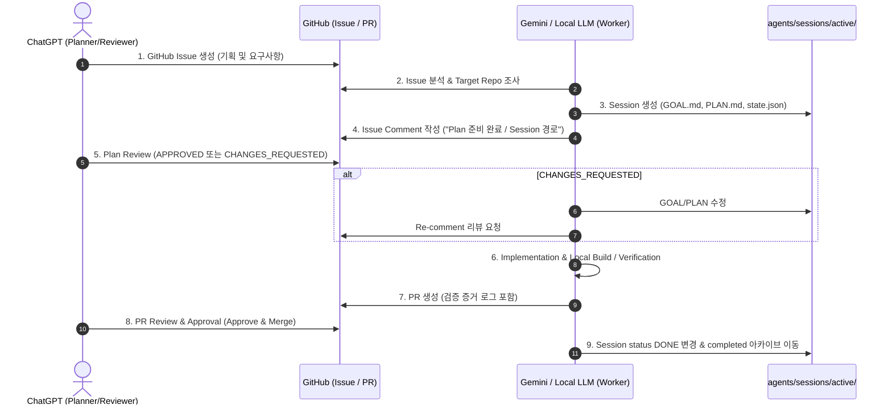

# 🤖 AGI with GPT — Bootstrap & Collaboration Loop

`agi-with-gpt`는 여러 Coding Agent(Gemini, Local LLM)와 ChatGPT를 연결하여 실제 다양한 Target Software Repository를 지속적으로 협업 개발하기 위한 **Coding Agent Collaboration Environment**입니다.

---

## 1. 프로젝트 목적 및 에이전트 역할

이 레포지토리는 직접적인 애플리케이션 코드를 작성하는 모노레포가 아니며, 여러 Target Repository(Promptia, PDF 문서 분석기, GoVail 등)의 개발을 지휘하고 실행하는 **Coding Agent 운영 단일 진실의 출처(SSOT)** 역할을 수행합니다.

### 🎭 역할 분담 (Role Boundaries)

| 주체 | 역할 (Responsibilities) |
| :--- | :--- |
| **ChatGPT** | 기획, 다음 작업 판단, GitHub Issue 생성, PLAN/GOAL Review, 구현 Review, PR Review & Approval |
| **Gemini (Primary)** | Primary Coding Worker, Target Repo 조사, 세션 수립, 계획/구현/테스트/빌드 검증, PR 생성 및 Review 반영 |
| **Local LLM (Secondary)** | Secondary Coding Worker, 반복적인 코드 작업, 코드 분석, 보조 구현, local verification |

### 🎯 주요 Target Repositories
- **딸깍소설 / Promptia** (`~/srv/promptia`)
- **PDF / PPT / Markdown 문서 분석·검증 프로젝트**
- **향후 생성될 AI 서비스 레포지토리**
- **GoVail 및 기타 연관 인프라 프로젝트**

---

## 2. 전체 Collaboration Loop



---

## 3. agents SSOT 디렉토리 구조

`agents/` 디렉토리는 에이전트 운영의 단일 진실의 출처(SSOT)입니다.

```text
agents/
├── rules/                  # 어떻게 행동해야 하는가 (가드레일, 노드역할, 보안수칙)
│   ├── 00-core-rules.md
│   ├── 01-security-and-isolation.md
│   └── 02-session-lifecycle.md
├── skills/                 # 무엇을 할 수 있는가 (재사용 도메인 지침 & 체크리스트)
│   ├── repository-analyst/
│   ├── github-workflow/
│   └── review-loop/
├── templates/              # 무엇을 어떤 형식으로 기록하는가 (GOAL/PLAN/State/Comment/PR)
│   ├── GOAL.template.md
│   ├── PLAN.template.md
│   ├── session-state.template.json
│   ├── ISSUE_COMMENT.template.md
│   └── PR_DESCRIPTION.template.md
├── workflows/              # 어떤 순서로 움직이는가 (Collaboration Loop & Transition)
│   ├── collaboration-loop.md
│   └── session-transition.md
└── sessions/               # 지금 실제로 무엇을 하고 있는가 (Execution State)
    ├── active/             # 현재 진행 중인 세션
    └── completed/          # 완료되어 아카이브된 세션
```

---

## 4. Session 실행 상태 (Execution State)

별도의 `.ai/state` 디렉토리를 사용하지 않으며, 모든 실행 상태는 `agents/sessions/` 하위에서 영속 관리됩니다.

### Session ID 명명 규칙
Target Repository와 GitHub Issue 번호를 조합하여 고유한 이름을 생성합니다:
```text
<target-repo>-issue-<github-number>
```
*예시: `promptia-issue-31`, `document-validator-issue-7`, `govail-issue-52`*

### 세션 디렉토리 내부 구성
`agents/sessions/active/<session-id>/`
- 🎯 `GOAL.md` : 최종 목적, Success Criteria, Hard Constraints
- 📋 `PLAN.md` : 단계별 실행 계획, 빌드/검증 명령, 위험 요소
- ⚙️ `state.json` : Machine-readable 실행 상태, decisionLog, modifiedFiles, reviewStatus

---

## 5. 보안 및 커밋 규정 (Strict Security Policy)

본 레포지거리는 GitHub `devcy0922` 계정의 **Public Repository**로 운용됩니다. 아래 보안 규정을 엄수해야 합니다.

1. **`.env` 파일 커밋 절대 금지**: 모든 시크릿, 환경 변수 파일은 `.gitignore`에 의해 차단되며 git에 커밋되지 않습니다.
2. **사설 IP (`192.168.x.x`) 노출 절대 금지**: 내부 사설 IP, 서브넷 정보, 비밀 토폴로지는 문서나 소스코드로 공개 금지됩니다.
3. **API Key 및 Private Credentials 유출 금지**: OpenAI/Gemini Key, Personal Access Token 등은 커밋 및 세션 기록 금지됩니다.

---

## 6. Bootstrap & 진입 방법

어떠한 Coding Agent든 작업을 개시할 때는 최우선적으로 [AGENTS.md](AGENTS.md)를 읽고 컨텍스트를 동기화해야 합니다.
